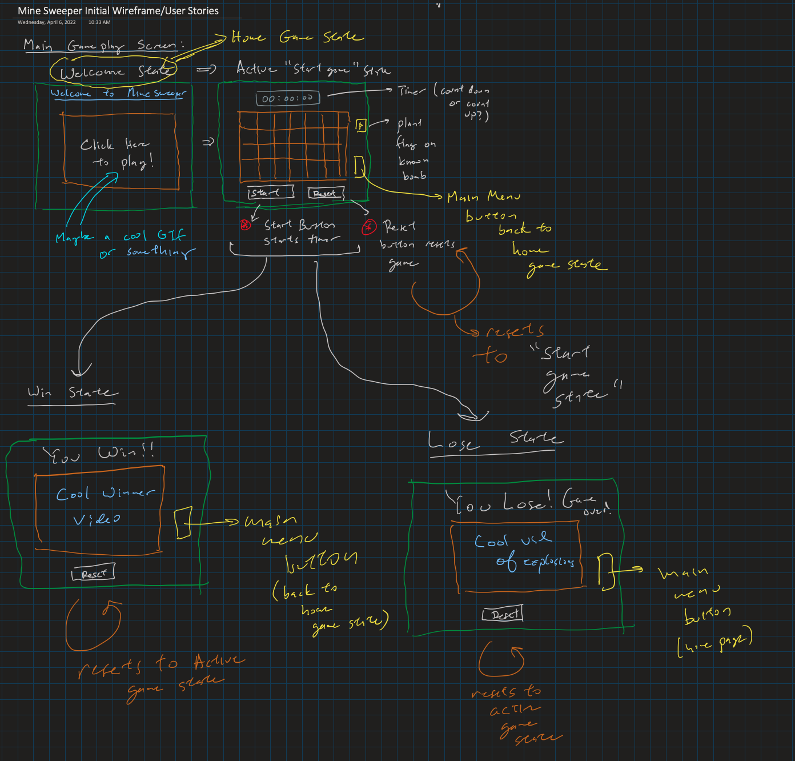
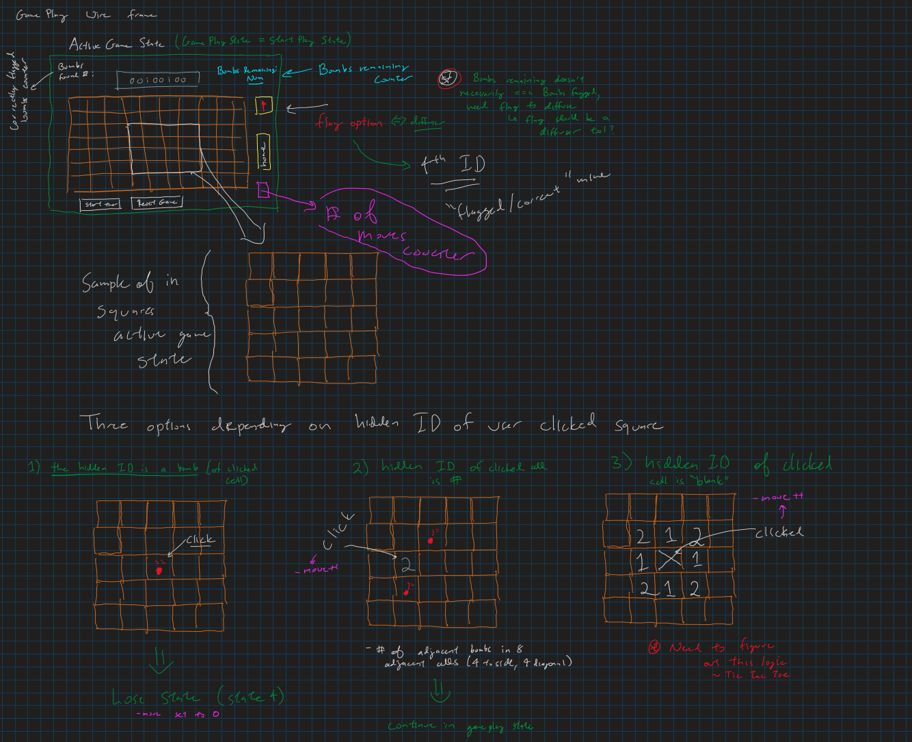
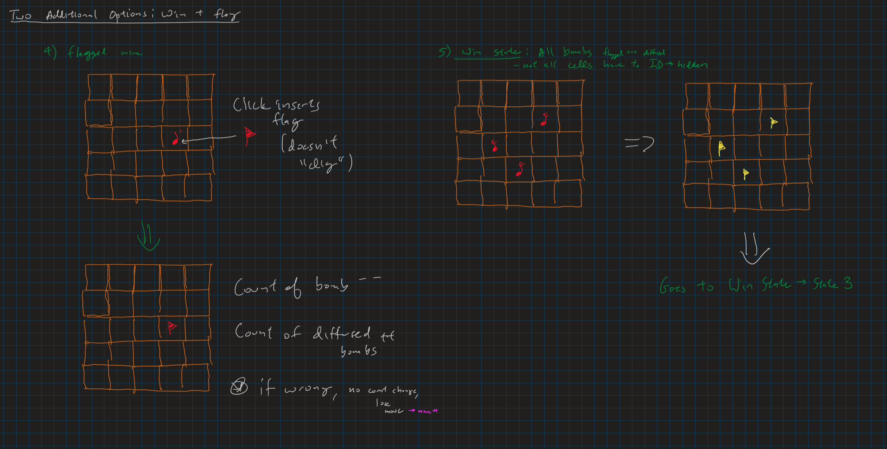

Welcome to Mine Sweeper Extreme!!

In this game, the game board is divided into cells. Hidden within these cells are randomly distributed bombs, or mines. 

When a player clicks a cell, one of three choices are possible with respect to the resultant identity of that cell:

1) There is a bomb! You hit a mine with your mouse and the game is over

2) there is a number corresponding to the number of bombs adjacent to the square

3) there is a blank cell, meaning there are no bombs around. In this case the adjacent squares will automatically reveal themselves in all 8 directions (sides and diagonals) up until a square is revealed that has a number identity. This happens in all 8 adjacent directions simultaneously.

For Mine Sweeper Extreme, all mines will have to be flagged to win! A player should use the cell numbers to guide them as a strategy.

A player can choose whether to play against a timer or # of moves

Wire frame of the main page:

Wire frame image main page

Main page wireframe explanation with pseudocode functionality

There are four "states" of the game's main page

State 1) the Welcome State or Home Game State:
    - title header
    - cool vid or gif with a hidden overlayed button that starts the game (changes to State 2)
    - maybe a menu of game options here
        - either timer game play 
        - or # of moves game play
        - or just flag all of the mines game play

State 2) the Active "Start Game" state
    - here you see the un touched cells
    - there is a start timer button
    - there is a reset button that returns the game to its original "start game state"
    - there is a flag button to mark the guessed mines
    - There is a button that returns to the Home Game State (state 1)
    - note the Start Game state = Play game state when player is active

State 3) Win State
    - if a player wins the main page of game converts to a win state
    - Header says "you win!!"
    - there is a cool winner video/graphic/something
    - Reset button remains to reset game to State 2 (active state)
    - Main menu button returns to State 1 (home state)

State 4) Lose State
    - if player loses in State 2, Start Game State (which equals play game state), becomes "Lose State"
    - There is a cool explosion graphic/gif/somthing
    - Header becomes "You Lose! Game Over!"
    - Reset button remains to reset game to State 2 (active state)
    - Main menu button returns to State 1 (home state)

Wire frame of the active gameplay state:

Wire frame image game play

Wire frame of flag and win conditions, continued from active game play state

Game Play PseudoCode:

