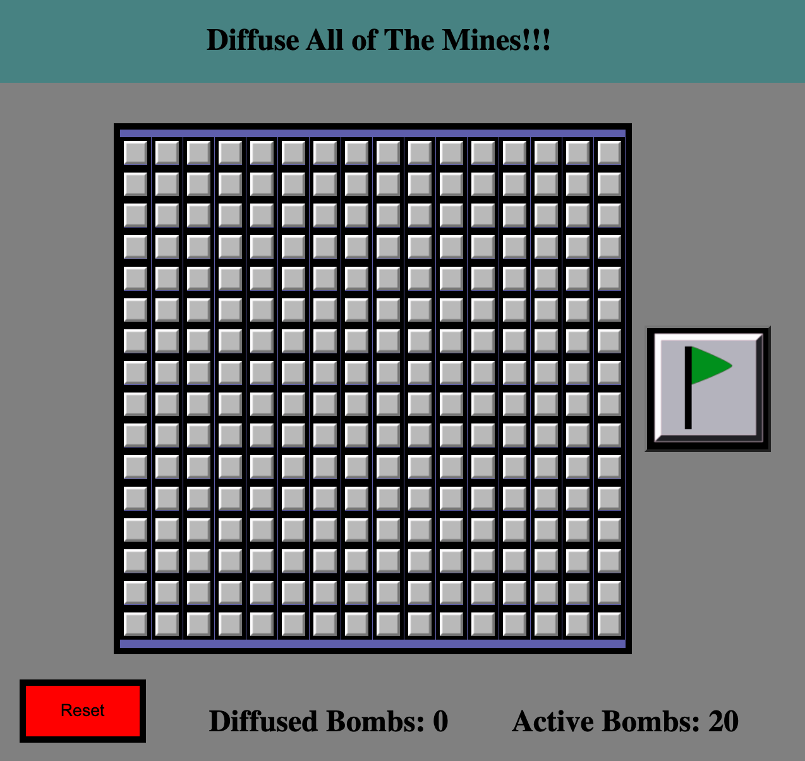
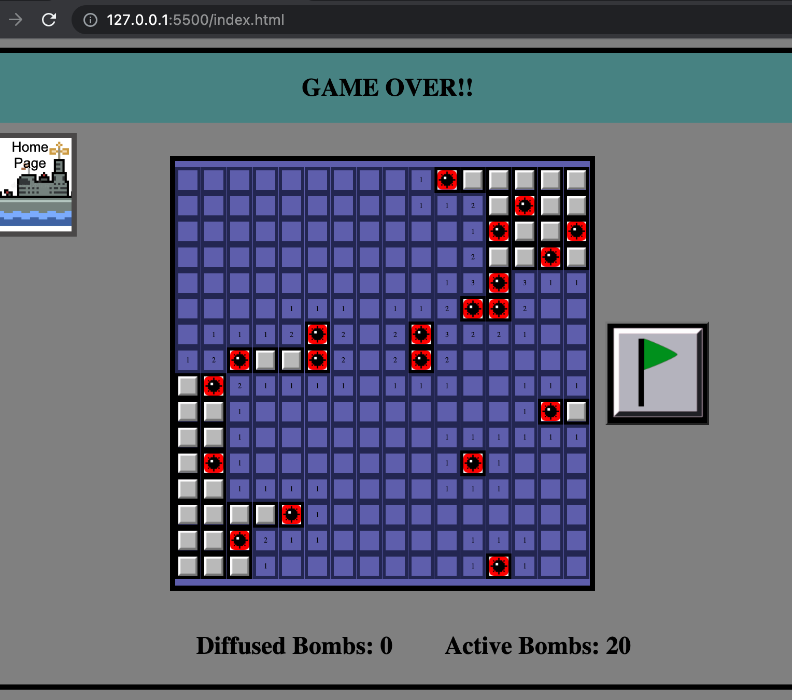
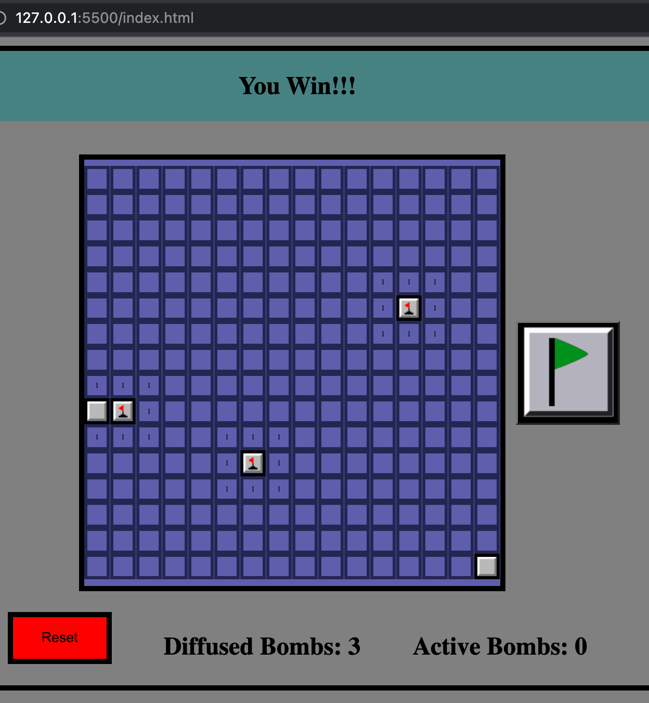
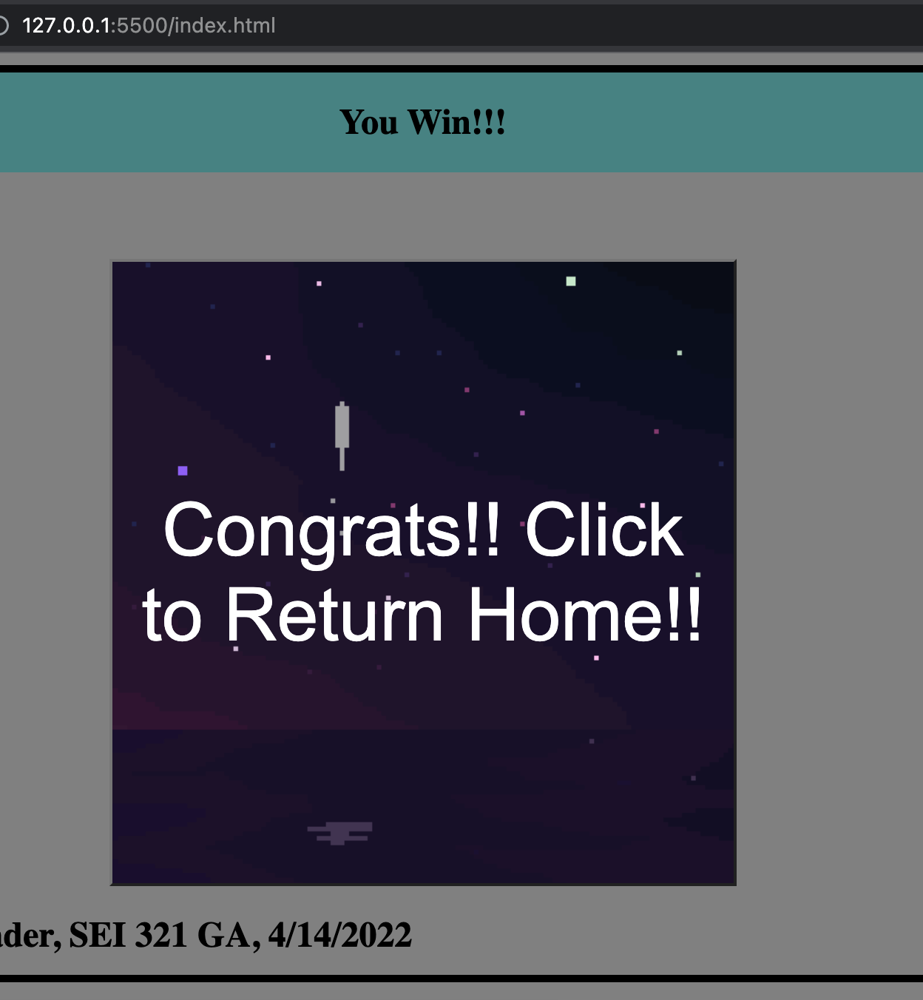
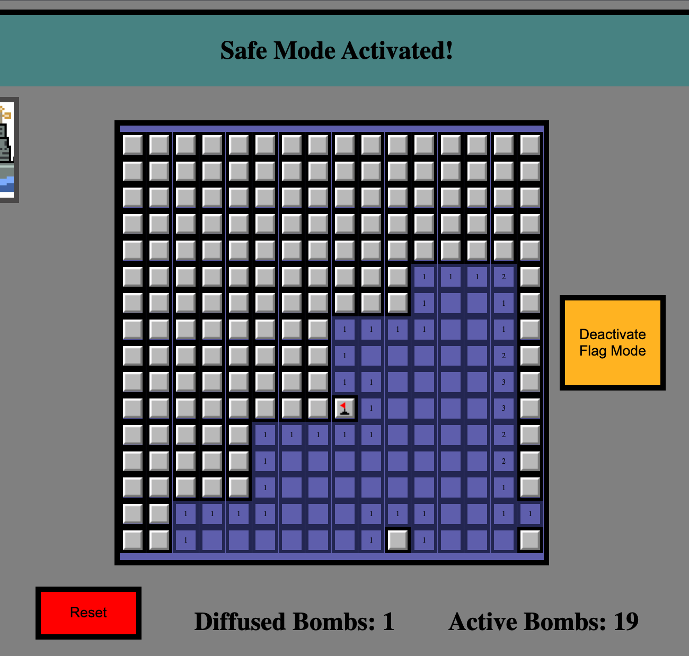

** need to npm i to install dependencies/node_modules

Welcome to Mine Sweeper Extreme!!

Game explanation:

In this game, the game board is divided into cells. Hidden within these cells are randomly distributed bombs, or mines. 

When a player clicks a cell, one of three choices are possible with respect to the resultant identity of that cell:

1) There is a bomb! You hit a mine with your mouse and the game is over

2) there is a number corresponding to the number of bombs adjacent to the square

3) there is a blank cell, meaning there are no bombs around. In this case the adjacent squares will automatically reveal themselves in all 8 directions (sides and diagonals) up until a square is revealed that has a number identity. This happens in all 8 adjacent directions simultaneously.

Click the flag button to diffuse each bomb when supposed bomb-cells are found! If you hit a bomb cell without activating the flag "safe-mode" first, you lose!

For Mine Sweeper Extreme, all mines will have to be flagged to win! A player should use the cell numbers to guide them as a strategy.

Starting board screenshot:

Losing board screenshot:

Be patient, diffuse all the bombs and win!!!

Winning board screenshot:

earn that fireworks celebration!!:

Flag safe mode activated (can manipulate bomb cells safely!):

Technologies Used:
Javascript, HTML, CSS, jQuery, Flexbox

Getting Started:
Click on link to deploy the game! Have a blast!

https://andrewrbader.github.io/sei321-Project-1-BrowserGame/

Icebox items:

1) set up different difficulty levels with # of mines for easy, medium, hard, extreme

2) Timed games

3) mobile first design: it works on mobile but the screen elements don't alter yet for optimal ergonomics/set up

